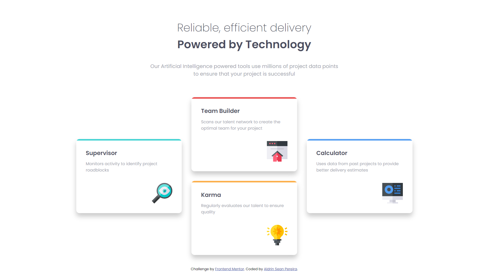

# Frontend Mentor - Four card feature section solution

This is a solution to the [Four card feature section challenge on Frontend Mentor](https://www.frontendmentor.io/challenges/four-card-feature-section-weK1eFYK). Frontend Mentor challenges help you improve your coding skills by building realistic projects. 

## Table of contents

- [Overview](#overview)
  - [The challenge](#the-challenge)
  - [Screenshot](#screenshot)
  - [Links](#links)
- [My process](#my-process)
  - [Built with](#built-with)
  - [What I learned](#what-i-learned)
  - [Continued development](#continued-development)
  - [Useful resources](#useful-resources)
- [Author](#author)
- [Acknowledgments](#acknowledgments)

## Overview

### The challenge

Users should be able to:

- View the optimal layout for the site depending on their device's screen size

### Screenshot



### Links

- Solution URL: [Link](https://github.com/AldrinSeanPereira/four-card-feature-section-master)
- Live Site URL: [Link](https://iridescent-dieffenbachia-9ce774.netlify.app/)

## My process

### Built with

- Semantic HTML5 markup
- CSS custom properties
- BEM naming convention
- CSS Grid
- Mobile-first workflow

### What I learned

This is my first project using CSS Grid throughout. 

It also showcases my ability to create high quality maintainable code using BEM naming convention and custom reusable properties in CSS 

Combining the BEM naming + Custom properties + CSS Grid made me feel so happy to make this project

```html
<div class="card-grid__middle-cards">
        <div class="card-grid__card card-grid__second-card">
          <h3 class="card-grid__headings">Team Builder</h3>
          <p class="card-grid__paragraphs">Scans our talent network to create the optimal team for your project</p>
          
        </div>

        <div class="card-grid__card card-grid__third-card">
          <h3 class="card-grid__headings">Karma</h3>
          <p class="card-grid__paragraphs">Regularly evaluates our talent to ensure quality</p>
          
        </div>
      </div>
```
<br>

The CSS in the media query for card grid is plain awesome!!

For grid columns, we are repeatedly creating columns of a size equal to a single card at minimum. 

So when the browser window grows, and there is enough space, a column is created to hold a card.

We wont get more than 3 columns totally as the containing body width is limited to 1440px.

```css
:root {
    --space-60px: calc((60/16) * 1rem);
}

@media (min-width: 600px) {
    .card-grid {
        grid-template-columns: repeat(auto-fit, minmax(var(--card-size), 1fr));
        column-gap: var(--space-30px);
        align-items: center;
    }

    .card-grid__middle-cards {
        display: grid;
        row-gap: var(--space-30px);
    }
}
```

### Useful resources

Pro tip: use ALL resources!!

- [BEM naming style](https://css-tricks.com/bem-101/)
- [CSS Grid - Repeating columns code inspiration](https://youtu.be/x4u1yp3Msao?si=8NcgyQzcAdNZ4UOx)
- [My gold standard practical CSS Grid reference](https://www.freecodecamp.org/news/learn-css-grid-by-building-5-layouts/) - I have been referring to this so many times its that good!

## Author

- GitHub - [Aldrin Sean Pereira](https://github.com/AldrinSeanPereira)
- Frontend Mentor - [@AldrinSeanPereira](https://www.frontendmentor.io/profile/yourusername)
- LinkedIn - [aldrinseanpereira](https://www.linkedin.com/in/aldrinseanpereira/)

## Acknowledgments

Thanks to frontend mentor and all the team in their discord server in the help section!!